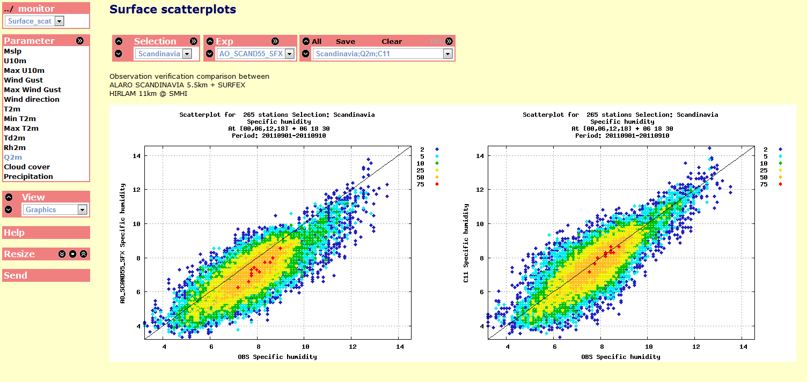
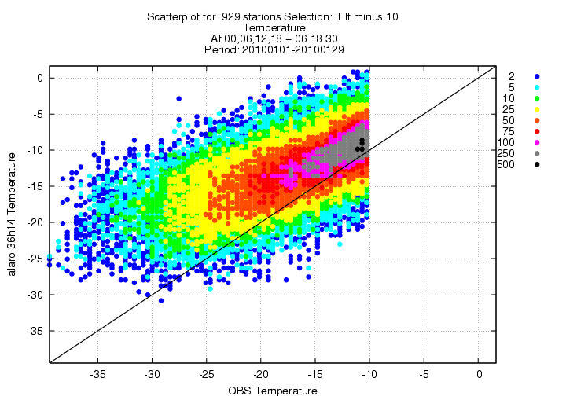

# Monitor



The verification package in HARMONIE is designed to be a self contained stand alone package dealing with pre-extracted model and observational data. The package calculates several standard verification scores such as:

* Error as function of forecast lead time summarises the bias and rms­ error and their growth rate over a set of forecasts
* Time sequences and vertical profiles show how your data or error characteristic is distributed in time or in the vertical
* Error charts and tables show how some error is distributed in space, and station­wise linear correlation
* Scatter plots show the correspondence between forecast and observed values
* Mean diurnal cycles show how your mean error changes in the course of the day
* Histograms show the correspondence between the distributions of forecast and observed values
* Student t-test to show how reliable differences between different experiments are

In addition there are a number of scores based on contingency tables like:

| score | description | Range | Perfect Score | 
| :---- | :---------- | ----- | ------------- | 
|Frequency bias (bias score) | ``(h+fa)/(h+m)``; Compares the frequency of predicted events to the frequency of observed events | ``[ 0 , ∞)`` |  ``1`` |
| Hit rate (probability of detection) |  ``h/(h+m)``; What fraction of the observed events were correctly forecast |  ``[0, 1]`` |   ``1`` |  
| False alarm ratio | ``fa/(h+fa)``; What fraction of the predicted events did not occur |  ``[0, 1]`` |  ``0`` |
| False alarm rate | ``fa/((cn+fa)``; What fraction of the observed "no" events were incorrectly forecast as "yes" | ``[0, 1]`` |  ``0`` |
| Threat score | ``h/(h+m+fa)``; How well did the forecast "yes" events correspond to the observed "yes" events. | ``[0, 1]`` |  ``1`` |
|The Equitable threat score | takes into account the number of random hits (``R``) and is less sensitive to climatology: ``ETS=(h­R)/(h+m+fa­R)``,  ``R=(h+m)(h+fa)/(h+m+fa+cn)``. Often used in verification of precipitation. |``[-⅓, 1]``  | ``1``, 0=no skill | 
|Hansen­Kuipers score | (``h/(h+m)`` ­``fa/(fa+cn)``), How well did the forecast separate events from non­events. | ``[-1, 1]`` | ``1`, 0 = no skill |
|Extreme Dependency Scores | What is the association between forecast and observed rare events? | ``[-1, 1]``  |  ``1``, 0 = no skill|

A more detailed explanation about verification can found [here](http://www.cawcr.gov.au/projects/verification/)

The scores can be presented per station for the whole data set or filtered through different selection criteria based on e.g. a geographical domain or properties of the data itself. One key feature missing in earlier HIRLAM verification packages is that the comparison is done over exactly the same set of data ( in time and space ) when comparing different experiments or models. The scores are finally presented with a portable web interface, [WebgraF](./webgraf.md), that allows you to easily share the information with others. Since the verification is station based it is less suitable for moving platforms or fields.

Other examples on how products from the verification package looks like today can be found here:
 * [The monitor test data set](https://hirlam.org/portal/smhi/WebgraF_test_data/)
 * [FMI](http://fminwp.fmi.fi/WebgraF/FMI-HARMONIE/)
 * [Mast verification](http://fminwp.fmi.fi/mastverif_stats/SODA_2012_JJA_export/)
 * [HIRLAM verification portal](https://hirlam.org/portal/oprint/WebgraF/ObsVer/HAAA/) 

In the following we describe the different parts of the verification package. For preparation of verification data read more [here](https://hirlam.org/trac/wiki/HarmonieSystemDocumentation/PostPP/Extract4verification).

# Getting and compiling the code

The verification code can be fetched from the hirlam code repository by

```bash
git clone https://github.com/Hirlam/monitor
cd monitor
git checkout v1.1
```

It contains all the history from the old subversion repository. For specific old tagged versions please us monitor from a harmonie version like

```bash
svn co https://svn.hirlam.org/tags/harmonie-40h1.1.1/util/monitor
```

The checkout gives you the following directories:

| Directory | Description | 
| :-------- | :---------- |
| `cmastat` | for assimilation monitoring, not covered here |
| `config`  | configuration files for different platforms|
| `doc`     | README files|
| `mod`     | Different modules. `module_data.f90` contains all namelist variables|
| `prg`     | Main programs|
| `rdr`     | Routines for reading data|
| `scr`     | Scripts|
| `src`     | The hard core verification routines|
| `tools`   | Compilation tools|
| `WebgraF` | The web interface|

You compile by finding the appropriate configuration file for your platform and type

```bash
gmake ARCH=YOUR_ARCH
```

The package has no external dependencies but relies on gnuplot for generation of the graphics.

# The verification step by step

The strategy in the verification is to separate the data input from the calculations of the different scores. This allows as to go through the data several times using different filtering criteria. Of course keeping everything in memory sets a limit on how much data one can handle at the same time. In the way it's used in HARMONIE a typical sequence is:

 - Read namelist
 - Call my_choices
     - Read observations
     - Read model data
     - Perform quality control

 - Loop over all namelists
     - Selection of data 
     - Calculate the scores and write data
     - Check for new namelist

### Reading the data 

The program can handle several data sources. Which one you use is depending on the value of `DATA_SOURCE` and is controlled in the routine [`my_choices.f90`](https://github.com/Hirlam/Monitor/tree/master/src/my_choices.f90). At namelist level we also control which experiments we should read, the period (`SDATE`,`EDATE`), interval between cycles (`FCINT`), which forecasts (`FCLEN`) and the interval of the observations (`OBINT`). We can also already at this point select which stations to use by specifying a station list (`STNLIST`). 

The HARMONIE tools to extract data for verifiation are described in [here](https://hirlam.org/trac/wiki/HarmonieSystemDocumentation/PostPP/Extract4verification).

### A general input format 

For the every day verification the model and observation data are read with the routines 

  - [`read_vfld.f90`](https://github.com/Hirlam/Monitor/tree/master/rdr/read_vfld.f90)
  - [`read_vobs.f90`](https://github.com/Hirlam/Monitor/tree/master/rdr/read_vobs.f90)
  - [`read_vfld_temp.f90`](https://github.com/Hirlam/Monitor/tree/master/rdr/read_vfld_temp.f90)
  - [`read_vobs_temp.f90`](https://github.com/Hirlam/Monitor/tree/master/rdr/read_vobs_temp.f90)

Where the two first are for surface data and are used when `DATA_SOURCE=vfld` and the two latter for temp data and are used when `DATA_SOURCE=vfld_temp`. During the evolution of the verification package the format of the input data has changed and we are now at version four. The new format allows an arbitrary number of different types of point data to be included in the model vfld- or observation vobs- files.

The generalized input format is defined as 

```bash
nstation_synop nstation_temp version_flag  # written in fortran format '(1x,3I6)' )
# where version_flag == 4
# If ( nstation_synop > 0 ) we read the variables in the file, their descriptors and
# their accumulation time
#
nvar_synop
DESC_1 ACC_TIME_1
...
DESC_nvar_synop ACC_TIME_nvar_synop
# Station information and data N=nstation_synop times
stid_1 lat lon hgt val(1:nvar_synop)
...
stid_N lat lon hgt val(1:nvar_synop)

# If ( nstation_temp > 0 )
nlev_temp
nvar_temp
DESC_1 ACC_TIME_1
..
DESC_nvar_temp ACC_TIME_nvar_temp
# Station information and data nstation_temp times
# and station data nlev_temp times for each station
stid_1 lat lon hgt
pressure(1) val(1:nvar_temp)
...
pressure(nlev_temp) val(1:nvar_temp)
stid_2 lat lon hgt
...
```

The accumulation time allows us to e.g. easily include different precipitation accumulation intervals. Any variable can be included in the file and verified without any code changes. Once you have defined a variable in your data you have to describe its properties in the [`plotdefs.pm`](https://github.com/Hirlam/Monitor/tree/master/scr/plotdefs.pm) described in the [#Settingsfordifferentmeteorologicalparameters parameter setting section].

### Quality control 

The quality control is activated by the namelist flag `LQUALITY_CONTROL`. It is mainly there as a gross error check to remove the unrealistic observations. The check has the following features:

 * The forecast lengths used for quality control can be set by namelist variable `QC_FCLEN`. If `QC_FCLEN` is not set The forecasts < `FORECAST_INTERVAL` will be used.
 * An observation is accepted if `ABS(mod - exp) < err_limit` for ANY experiment used in the verification. 
 * The quality control limits can be set explicitly in namelist by `VARPROP%LIM` for any variable or by `QC_LIM` for all variables. See the section about [ #Settingsfordifferentmeteorologicalparameters parmeter settings] for further instructions.
 * By setting `ESTIMATE_QC_LIMIT` the `QC_LIM` will be set as `SCALE_QC_LIM * STDV` for the forecasts in `QC_FCLEN`.

QC diagnostic information output may be controlled by `PRINT_QC={0,1,2}`. It is also possible to blacklist stations through the `STNLIST_BL` parameter.

In the HARMONIE implementation all quality control levels are estimated on the fly with a limit where the standard deviation is scaled by 5.

### The selection process 

Before we run through the actual comparison of data we can select a subset of the data depending on different criteria.

 * Initial time of the forecast (`INI_HOURS`)
 * Select data that are valid at a certain hour (`SHOW_TIMES`) 
 * Pick only some of the forecast lengths in memory (`USE_FCLEN`)
 * Selection using a station list (`STNLIST`)
 * Select to produce statistics for some selected stations in addition to the overall statistics (`STNLIST_PLOT`)
 * Define a geographical box through the definition of the corners (`CBOX%ACTIVE`,`CBOX%S`,`CBOX%W`,`CBOX%N`,`CBOX%E`).
 * Use an area defined by a polygon (`LPOLY,POLYFILE`)
 * Select by station height (`HGT_LLIM,HGT_ULIM`)
 * Conditions given by the data (described later)
 * Reverse all selections but the conditional (`REVERSE_SELECTION`)

Of course all the selections can be combined.

### The verification loop 

For each station we loop over all selected stations, initial times, forecast lengths for the given period and accumulate the statistics.
Data is stored by:
  * Statistic by forecast length or time of day, for each station and accumulated for all stations and is used to generate error maps(`MAP`), vertical profiles(`VERT`), standard forecast length verification(`GEN`) and daily variation scores (`DAYVAR`)
  * Time serie arrays for each station and accumulated for all stations (`TIME`)
  * One array containing all the selected data used for scatter plots (`SCAT`) and contingency table calculations (`CONT`). From the contingency table we can calculate several different scores described later.

### Output format 

 Early versions of the package was based on the ECMWF graphics package MAGICS. Due to the poor portability of MAGICS the package now a days produces text files that are parsed through a [script](https://github.com/Hirlam/Monitor/tree/master/scr/verobs2gnuplot.pl) that produces plots using gnuplot. It may not be the most elegant graphics package, but it is available almost everywhere. Some verification are also produced in form of tables. The contingency tables are parsed through [`contingency2gnuplot.pl`](https://github.com/Hirlam/Monitor/tree/master/scr/contingency2gnuplot.pl) to produce skill scores.

# HARMONIE user interface

In HARMONIE a set of scripts is build around the code for generation of plots and building the web page. 

!!! note

    `Run_verobs_surface` `Run_verobs_temp`  do not exist
    

There are two main scripts  `Run_verobs_surface`](https://github.com/Hirlam/Monitor/tree/master/scr/Run_verobs_surface)  for verification of surface variables and `Run_verobs_temp`](https://github.com/Hirlam/Monitor/tree/master/scr/Run_verobs_temp)  for verification of radio sonde data. Both of them need a configuration file, `Env_exp`, as input:

```bash
./Run_verobs_surface MY_ENV_EXP
./Run_verobs_temp MY_ENV_EXP
```

There is also a master script [`Run_verobs_all`](https://github.com/Hirlam/Monitor/tree/master/scr/Run_verobs_all) which cleans the webpage, runs through both types of verification and creates a tar file suitable to add to an existing WebgraF page. It is used in the same way like:

```bash
./Run_verobs_all MY_ENV_EXP
```


## The main configuration file 

For most of the cases you can configure your verification by just editing the configuration file, [`Env_exp`](https://github.com/Hirlam/Monitor/tree/master/scr/Env_exp). The above mentioned script can take files with any name so it's a good idea to have different files for different sets of experiments. First you have to identify your experiments and their location. 

```bash
# Experiment names and paths,should be space separated
DBASE=/scratch/ms/dk/nhz/oprint
EXP="RCR C22"
DISPLAY_EXP="$EXP"
OBSPATH=$DBASE/OBS2/
P1=$DBASE/RCR/
P2=$DBASE/C22/
MODPATH="$P1 $P2"
```

The experiment name should of course match the name on the vfld files. At the moment there is an upper limit of ten experiments, but already at five the plots starts to get pretty messy. It is possible to disply more meaningful names by setting DISPLAY_EXP to something different.

From `harmonie-40h1.1.1.rc1` the output from the verification for the initial setup has changed so that 

* `vfldEXPYYYYMMDDHH` represents analysis data
* `vfldEXPYYYYMMDDHHLL` represents output from the forecast model at +00

To handle this `USE_ANALYSIS` has been introduced to allow different choices and combination of the new and old convention.

```bash
# Use analysis at +00h, set per experiment
USE_ANALYSIS=".FALSE.,.TRUE.,.FALSE.,.TRUE.,.TRUE."
```

We should now defined the name on the WebgraF page and write some text ( in simple html syntax ) describing the experiments.

```bash
# Project name, will be the name on the web page
PROJECT=monitor

# Explanation on webpage
HELP="Observation verification comparison between \
      <br> FMI(RCR) \
      <br> SMHI(C22) \
     "
```

By having several configuration files with different `PROJECT` names you can gather all your verification plots under one web page. In next section we define the verification period. We can also say if we would like to verify the full period in one go or in monthly pieces by setting `PERIOD_TYPE`.

```bash
# Date handling
# PERIOD_TYPE 1 : SDATE - EDATE,
#             2 : SDATE - EDATE in monthly pieces
#
# IDATE is the very first date for PERIOD_TYPE=2 it determines the
# lentgh of the date menu in WebgraF
#
PERIOD_TYPE=1

SDATE=20080901
EDATE=20080905
IDATE=$SDATE
```

For operational runs it might be useful to set `PERIOD_TYPE=2` like [FMI](http://fminwp.fmi.fi/WebgraF/FMI-HARMONIE/) has done.

If you would like to monitor some special stations you can list them by station number.

```bash
#
# Single stations can be defined with comma separated
# station number and a text for the web page
#
# STNLIST_PLOT="00002574,00006348"
# STNLIST_PLOT_TXT="NORRKOPING,CABAUW"
#
STNLIST_PLOT=-1
STNLIST_PLOT_TXT=-1
```

Note that the zeros in the name matters since the plots are created with station id as eight digit numbers. A list of parameters to be verified are selected through `SURFPAR` and `TEMPPAR` respectively. 

```bash
######################
# Surface parameters #
######################
#
# Change in the file plotdefs.pm for text and limits
#
# PS : Mslp
# TT : T2m
# TTHA : T2m, adjusted for model and observation station height differences
# TN : Min T2m
# TX : Max T2m
# TD : Td2m
# FF : Wind speed
# FX : Max wind speed
# GG : Wind gust
# GX : Max wind gust
# DD : Wind direction
# QQ : Specific humidity
# RH : Relative humidity
# PE : Precipitation
# NN : Total Cloud cover
# VI : Visibility, not in vfld files yet
#

# Active parameters
SURFPAR="PS FF FX GG GX DD TT TN TX TD RH QQ NN PE"
```

Note that not all parameters are available in the vfld files for HARMONIE yet. The number of levels to be used for `TEMP` is set in `LEV_LST`.

Comment in the code `fldextr_pp.f` explains `TTHA`, the moist adiabatic adjustment:

```
c adiabatic height correction of station values
c T2M_corr=T2M+[(STATION_HEIGHT-MODEL_HEIGHT)*ADIABATIC_LAPSE_RATE]
c ex: STATION_HEIGHT = 400 masl; MODEL_HEIGHT = 500 masl T2M = 10
c     T2M_corr=10+(400-500)*(-0.0065)=10+0.6=10.6
```

By setting `SURFPLOT` and `TEMPPLOT` we choose what kind of statistics we would like to produce. 

```bash
# Things to plot:
# GEN    : General forcast length statistics
# TIME   : Timeserie statistics
# SCAT   : Scatterplot
# MAP    : Bias maps
# FREQ   : Frequency plots
# DAYVAR : Daily variation
# XML    : Station statistics in xml format
# CONT   : Contingency tables
# VERT   : Vertical profiles only available for TEMP data
# SEAS   : Seasonal cycle
#
SURFPLOT="GEN TIME MAP FREQ SCAT CONT XML DAYVAR"
```

From the contingency tables we are also able to produce a number of skill scores either defined by their classes or thresholds.

```bash
# Select skill scores to be plotted if CONT is activated in SURFPLOT
# Frequency     : Frequency
# Frequencybias : Frequency bias
# POD           : Probability of detection ( hit rate )
# FAR           : False alarm ratio
# FA            : False alarm rate
# TS            : Threath score
# WILSON        : Wilson diagram, a combination of POD, TS, FAR and frequency bias
# KSS           : Hansen-Kupiers skill score
# AI            : Area index
# EDS           : Extreme Dependency Score
# SEDS          : Symmetric Extreme Dependency Score
# EDI           : Extremal Dependency Index
# SEDI          : Symmetric Extremal Dependency Index
# ETS           : Equitable threat score

SCORELIST="WILSON KSS Frequency"

# Select whether skill scores are based on classes and/or thresholds (CONT must be activated)
SCORETYPES="classes thresholds"
```

The meaning of the different abbreviations will be given in next section.

A selection of data is done by `SURFSELECTION` and `TEMPSELECTION`. The name in these list refers to definitions in [`selection.pm`](https://github.com/Hirlam/Monitor/tree/master/scr/selection.pm). We also select time and forecast interval by the `OBINT`, `FCINT` and `FCLEN` parameters.

At the end you would possibly like to change the graphics format of the output files.

```bash
#####################
# GRAPHICS and misc #
#####################

# Select output_type
# 1  Postscript + PNG
# 2  PNG
# 3  JPEG
# 4  SVG
OUTPUT_TYPE=2
```

The difference between the first `OUTPUT_TYPE` and the others is that in the first case gnuplot will produce postscript files that will be converted to PNG files and both files will be available on the web page. The SVG format (Scalable Vector Graphics) should allow plots with zoom functionality, but this does not yet work in the web interface. 

### Setting parameters for different types of plots 

If the settings in the main configuration file does not cover your needs you go to next level of the definition files. The namelists defining your verification run is build by [Build_namelist.pl](https://github.com/Hirlam/Monitor/tree/master/scr/Build_namelist.pl) by using your configuration file and three perl modules defining different parts. The logics behind the `GEN`, `MAP`, `TIME` switches are hidden in [`maindefs.pm`](https://github.com/Hirlam/Monitor/tree/master/scr/maindefs.pm). The first part defines the reading part:

```perl
%nameread=(
 'read_section' => {
    'SDATE'   => $ENV{SDATE},
    'EDATE'   => $ENV{EDATE},
    'NEXP'    => $nexp,
    'EXPNAME' => $exp,
    'MODPATH' => $modpath,
    'OBSPATH' => '\''.$ENV{OBSPATH}.'\'',
    'LQUALITY_CONTROL' => 'T',
    'ESTIMATE_QC_LIMIT'=> 'T',
    'MAXSTN'           => 5000,
    'STNLIST'          => 0,
    'STNLIST_PLOT'     => $ENV{STNLIST_PLOT},
    'LVERIFY'          => 'F',
    'PRINT_READ'       => 1,
    'PERIOD_TYPE'      => $ENV{PERIOD_TYPE},
    'OUTPUT_TYPE'      => $ENV{OUTPUT_TYPE},
    'OUTPUT_MODE'      => 2,
 },
) ;
```

Any new variable added here will also be set in the reading part of the namelist. The next part, def, defines values that are reset every time we loop through the verification and reads a new namelist. In the selectionloop part  we find the magic switches for the different `SURFPLOT`/`TEMPPLOT` keywords. The first one `SEAS` is only interesting if you run with a few parameters over several seasons. In the normal case several years of data doesn't fit in the memory so this is left for the experienced user.

The next one is `GEN`:

```perl
 'GEN' => {
 # Fclen plots
 'LSTAT_GEN'  => 'T',
 'LSIGN_TEST' => 'T',
 'SIGN_TIME_DIFF' => '-1',
 'LPLOT_STAT' => 'T',
 'SHOW_BIAS' => 'T',
 'SHOW_RMSE' => 'T',
 'SHOW_VAR'  => 'T',
 },
```

Here we set things for standard forecast length verification. We can choose to show bias, rmse and stdv by the `SHOW_*` variable. If `SHOW_VAR` is set plots comparing the model variability to the observed one will be produced. The significance of the difference between different experiments can be shown by setting `LSIGN_TEST`.

The next section handles the production of bias maps

```perl
 'MAP' => {
 # Map plots
 'PLOT_BIAS_MAP' => 'T',
 'PLOT_RMSE_MAP' => 'T',
 'LSTAT_GEN'     => 'T',
 'LPLOT_STAT'    => 'F',
 'LFCVER'        => 'F',
 'SHOW_TIMES'    => '00,12',
 'USE_FCLEN' => join(',',split(' ',$ENV{FCLEN_MAP})),
 },
```

Here we can show decide to show any of bias,rmse and stdv maps. The bias intervals for a given parameter are defined in [`plotdefs.pm`](https://github.com/Hirlam/Monitor/tree/master/scr/plotdefs.pm) discussed later. Here we have chosen to show only the 00 and 12 UTC maps.

Time serie statistics of the observed values and departures are produced by the `TIME` section.

```perl
 'TIME' => {
  # Timeseries
  'LTIMESERIE_STAT'=> 'T',
  'USE_FCLEN' => join(',',split(' ',$ENV{FCLEN_TIME})),
 },
```

Note that we explicitly set the forecast lengths we use. As for the `GEN` part the activation of bias, rmse and stdv plots are controlled by the `SHOW_*` parameters. The averaging period for time series are controlled per variable through the `TWIND_SURF` and `TWIND_TEMP` parameters in [`plotdefs.pm`](https://github.com/Hirlam/Monitor/tree/master/scr/plotdefs.pm).

Scatter plots and contingency tables are set in

```perl
 'scat_ver' => {
  # Scatterplots and freq,
  'LPREP_XML' => 'T',
  'LPLOT_FREQ'=> 'T',
  'LPLOT_SCAT'=> 'T',
  'USE_FCLEN' => join(',',split(' ',$ENV{FCLEN_SCAT})),
 },
```

By setting `LPREP_XML` we will get a list of stations sorted by decreasing rmse on the web page. This allows you to find the worst stations for different variables. The contingency part of this is defined in [`plotdefs.pm`](https://github.com/Hirlam/Monitor/tree/master/scr/plotdefs.pm). It is possible to create cross variable scatter plots where we compare different model parameters against each other or the observations. This is however not a part of the script system but be defined on the low level. Read more in [here](README_verobs#L250).

In some cases it's interesting to see how the model handles the daily cycle. In `DAYVAR` we define the flags to get this. The `LFCVER` tell the program that we should organize the statistics by time of day rather than by forecast length. We have also chosen to allow for a special set of forecast length here through the environment variable `FCLEN_DAYVAR` set in your configuration file

```perl
 'DAYVAR' => {
  # Daily variation
  'LPLOT_STAT' => 'T',
  'LSTAT_GEN'  => 'T',
  'LFCVER'     => 'F',
  'USE_FCLEN'  => join(',',split(' ',$ENV{FCLEN_DAYVAR})),
  'SHOW_OBS'   => 'T',
  'SHOW_VAR'   => 'F',
 },
```

The final part of [`maindefs.pm`](https://github.com/Hirlam/Monitor/tree/master/scr/maindefs.pm) deals with the vertical profiles. `LPLOT_VERT` is the flag telling us that we are doing a vertical profile. The major difference between this and `GEN` is that here we have chosen to split between night and daytime soundings by setting `SHOW_TIMES`.

Any valid namelist variable added to these sections will be picked up and used in the verification. 
 
### Settings for different meteorological parameters

 The different treatment of the different meteorological variables are done in [`plotdefs.pm`](https://github.com/Hirlam/Monitor/tree/master/scr/plotdefs.pm). In the first section we define the default values for all variables.

```perl
 'def'=>{
   'TWIND_SURF' => 06,
   'TWIND_TEMP' => 12,
   'QC_LIM_SCALE' => 5.,
   'MAP_BIAS_INTERVAL'=> '7*-1',
 },
```

 The `TWIND_*` parameter sets the time averaging window for time series for surface data and temp respectively. `QC_LIM_SCALE` is the scaling factor for the stdv used in the quality control. The `TEXT` variables sets the text for the title in the plots and the web page. For e.g. the cloud cover we have defined the classes for the contingency tables by setting `CONT_CLASS` and `CONT_LIM`. `MAP_BIAS_INTERVAL` set, as the name indicates, the intervals for the bias maps.

```perl
'NN'=>{
   'TEXT'        => 'Cloud cover',
   'CONT_CLASS'  => 7,
   'CONT_LIM'    => '1.,2.,3.,4.,5.,6.,7.',
   'PRE_FCLA'    => '1.,2.,3.,4.,5.,6.,7.',
   'MAP_BIAS_INTERVAL'=> '-6.,-4.,-2.,0.,2.,4.,6.',
 },
```

It is also possible to set the time window for timeseries separately for each variables like it is done for e.g. precipitation (`PE`). For accumulated and max/min parameters we also need to set the accumulation period. E.g. the maximum temperature for the past 12 hours is defined as

```perl
 'TX'=>{
   'TWIND_SURF'  => 12,
   'TEXT'        => 'Max T2m',
   'MAP_BIAS_INTERVAL'=> '-6.,-4.,-2.,0.,2.,4.,6.',
   'ACC'         => 12,
   'ACCTYPE'     => 3,
 },
```

Where `ACCTYPE` defines if it's an accumulated (1), minimum (2) or maximum (3)  parameter.

### Defining a new verification parameter 

As described in the [#Ageneralinputformat input format] section you can add any variable to the verification. Let's say you would like to verify precipiation accunulated over three hours and that you have called it `PE3H` in your data files.

```perl
 'PE3H'=>{
   'TEXT' => 'Precipitation 3h',
   'ACC'  => 3,
   'UNIT' => 'mm/3h',
 },
```

Where `TEXT` is the description to be displayed on the plot and the webpage, `ACC` is the accumulation period in hours and `UNIT` is the unit to be written to the plot. Of course the above mentioned properties can be set as well. Remember to add `PE3H` to the `SURFPAR` list in your definition file.

### Selection options 
 
It easy to select a subset of your data for verification and we have already discussed how it can be done by setting a list of stations or select different forecast lengths. In [`selection.pm`](https://github.com/Hirlam/Monitor/tree/master/scr/selection.pm) a number of different kind of selections have been defined. Several of them are just a list of stations like e.g. the well known (but perhaps not so well defined) `EWGLAM` list. An example of how a box can be defined is found for the Netherlands.

```perl
 'Netherland' => {
   'CBOX%ACTIVE' => 'T',
   'CBOX%SLAT' => '51.',
   'CBOX%WLON' => '1.5',
   'CBOX%NLAT' => '54.5',
   'CBOX%ELON' => '9.',
   }
```

We may also define our area of selection through a polygon.

```perl
 'BalticSea' => {
   'STNLIST'=> 0,
   'LPOLY'               => 'T',
   'POLYFILE'            => '\'Baltic_sea.poly\'',
   },
```

A more specialized case is the selection of stations by station height where the upper and lower limits are given.

```perl
  'masl_300m' => {
   'STNLIST'=> 0,
   'LSTN_HGT_CHECK'=>'.T.',
   'HGT_ULIM'=>1.e6,
   'HGT_LLIM'=>300.,
   },
```

Finally we can also do the selection based on meteorological criteria. In the example below we are interested in cases with low temperatures and weak winds.

```perl
  'temp_and_wind_limit' => {
    'COND%IND' => 'FF,TT',
    'COND%ULIM' => ' 5.,-10.',
    'COND%LLIM' => '-1.,-55.',
    'COND%LOBS' => 'T,F',
    'COND%ALL_MOD' => 'T,F',
  },
```



### Example of conditional selection

 * `COND%IND` sets the parameters
 * `COND%LLIM` sets the lower limits
 * `COND%ULIM` sets the upper limits
 * `COND%LOBS` `T` means apply condition on observations, `F` applies condition on model data
 * `COND%ALL_MOD`, `T` means condition is required for ALL models, `F` for ANY model


All the above mentioned selections can of course be combined in any way you can imagine.


